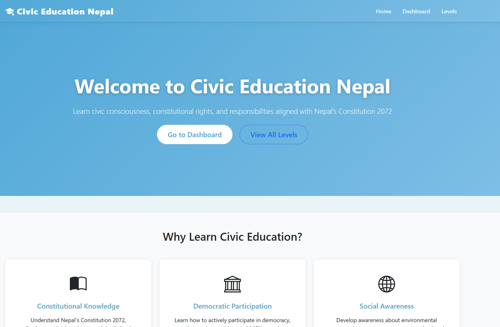
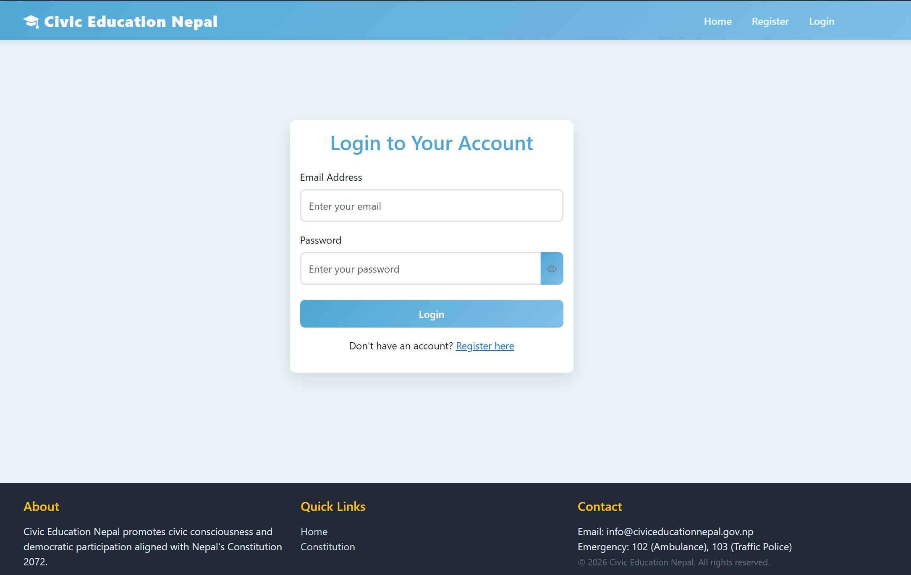
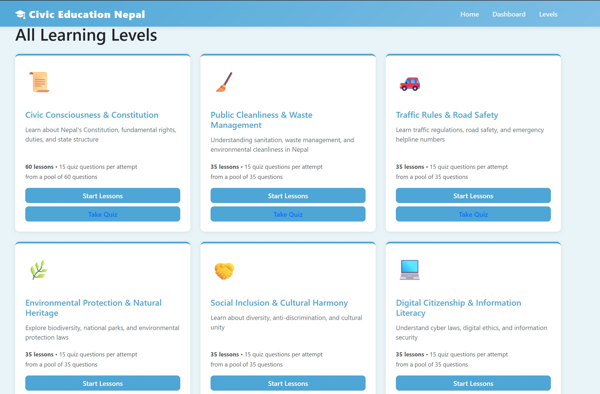
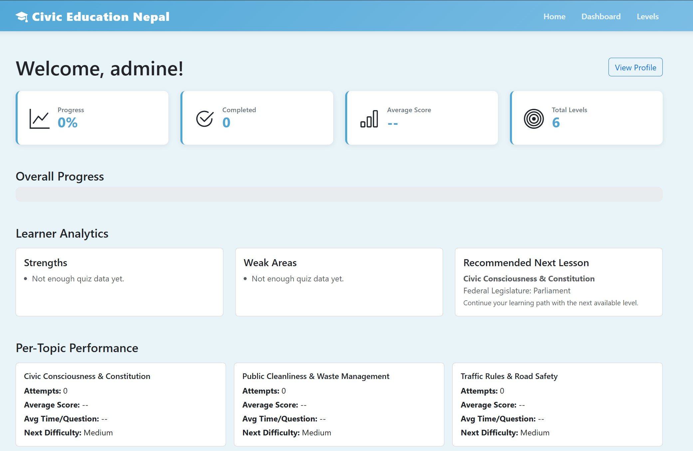

# Civic Education Nepal

<p align="center">
  <strong>A full-stack civic learning platform that transforms civic awareness into measurable learning outcomes.</strong>
</p>

<p align="center">
  <a href="https://civiceducator.onrender.com/">Live Demo</a> •
  <a href="#project-overview">Overview</a> •
  <a href="#the-motive-behind-the-project">Motive</a> •
  <a href="#who-this-project-helps">Audience</a> •
  <a href="#why-this-project-matters">Impact</a> •
  <a href="#how-it-works">How It Works</a> •
  <a href="#screenshots">Screenshots</a> •
  <a href="#getting-started-locally">Setup</a>
</p>

---

## Live Deployment

- **Production URL:** https://civiceducator.onrender.com/

## Project Overview

Civic Education Nepal is a web-based learning platform that teaches constitutional rights, duties, civic responsibilities, and public participation through structured learning levels and quizzes. The platform is designed to make civic education accessible, practical, and trackable for learners and organizations.

Unlike static civic content pages, this project combines:

- curriculum-style lesson progression,
- assessment through quizzes,
- adaptive difficulty behavior,
- progress and performance analytics,
- and content management through an admin interface.

The result is a complete learning system, not just an information website.

## The Motive Behind the Project

The project is built to address common civic learning challenges:

- Civic concepts are often taught in theory, but not practiced through evaluation.
- Learners may not know their weak areas or what to study next.
- Institutions and trainers need a manageable digital platform for civic education delivery.
- Community awareness programs need scalable tools beyond one-time sessions.

This platform solves those problems by turning civic education into a guided and measurable journey.

## Why This Project Matters

- Promotes informed citizenship and responsible social participation.
- Encourages critical understanding of rights and duties.
- Supports educators with measurable learner outcomes.
- Creates a reusable civic education infrastructure for schools, trainers, and community programs.

## What This Project Does

This application delivers structured civic education through lessons and quizzes, then tracks each learner’s progress with analytics and recommendations. It is designed to make civic learning practical, measurable, and easy to manage.

### Core Features

- Secure user registration and login
- Level-based lessons and quizzes
- Adaptive quiz behavior from recent performance
- Dashboard insights for strengths and weak areas
- Public guest-only About page with full platform walkthrough
- Authenticated Civic Assistant chatbot with floating access across pages
- Grounded chatbot answers with source citations, confidence scoring, and fallback behavior
- Admin tools for content and learner management

## Who This Project Helps

### 1) Students and Self-Learners

- Learn civic topics in simple, level-based steps.
- Test understanding immediately with quizzes.
- Monitor progress and identify weak areas for improvement.

### 2) Teachers and Trainers

- Use structured content and quizzes for classroom or workshop support.
- Track learner performance through dashboard metrics.
- Focus teaching efforts on weak topics.

### 3) NGOs and Community Programs

- Deliver civic awareness modules in a low-cost web format.
- Reach more participants with consistent learning quality.
- Use measurable results for program evaluation and reporting.

### 4) Platform Administrators

- Update content without frequent developer intervention.
- Manage users and maintain educational quality.
- Scale civic content and quiz banks over time.

## Key Advantages

- **Practical learning model:** lesson + quiz + feedback loop
- **Data-informed learning:** analytics reveal real performance patterns
- **Adaptive behavior:** quiz difficulty can respond to learner outcomes
- **Admin flexibility:** dynamic content operations through UI
- **Secure foundation:** core web security middleware and session protections
- **Deployment-ready:** production app running on Render

## How It Works

### 1) Authentication & Session Management

- Users sign up and log in through secure auth routes
- Passwords are hashed with `bcryptjs`
- Sessions are stored with `express-session` + `connect-sqlite3`

Security baseline includes request throttling, CSRF protection, secure headers, and server-side validation.

### 2) Lesson and Quiz Flow

- Learners study a level lesson, then attempt the quiz
- Questions are randomized with anti-repeat behavior
- Scores and progress are calculated and saved after submission

Each attempt contributes to a learner profile that can guide future study and recommendations.

### 3) Adaptive Learning Logic

- Past attempts (score and timing) influence quiz difficulty
- Difficulty is adjusted across `easy`, `medium`, and `hard`
- The app recommends next learning focus from weaker areas

### 4) Admin Content Operations

- Admin panel supports create/edit/delete for levels and lessons
- Quiz questions can be managed without direct code edits
- User access and account actions are available to admins

### 5) Civic Assistant (Grounded Chat)

- Signed-in users can ask questions from any lesson and any level
- The assistant retrieves evidence from existing lesson content only
- Responses include citations to level/lesson sources
- Minimum-confidence threshold is enforced before answering
- If confidence is low, assistant returns a safe "I don't know" fallback instead of guessing

### 6) Public About Walkthrough

- Signed-out users get a dedicated About page explaining platform purpose and value
- Includes end-to-end walkthrough of how learning, quizzes, and progress work

## User Journey (End-to-End)

1. User registers or logs in.
2. User opens available civic levels.
3. User studies lesson content.
4. User attempts level quiz.
5. User can ask the Civic Assistant for lesson-grounded clarification and citations.
6. System calculates score, records attempt, and stores progress.
7. Dashboard/profile reflects strengths, weak areas, and next focus.
8. Admin improves content over time based on learner behavior.

## Educational and Social Impact

- Encourages active democratic awareness.
- Improves civic knowledge retention with assessment-backed learning.
- Bridges the gap between civic theory and practical understanding.
- Helps institutions make evidence-based improvements to civic programs.

## Screenshots

These are key interfaces of the live system:

### Homepage



### Login



### Levels



### Dashboard



## Technical Overview

### Stack

- **Backend:** Node.js, Express
- **Template Engine:** EJS (server-rendered)
- **Database:** SQLite (`sqlite3`)
- **Session Store:** `connect-sqlite3`
- **Security:** `helmet`, `express-rate-limit`, `csurf`, `express-validator`
- **Logging:** `morgan`

### Internal Modules

- `routes/` handles auth, levels, admin, and chatbot endpoints
- `controllers/` manages request-level orchestration
- `services/` contains core business logic (quiz, analytics, profile, admin, chatbot retrieval)
- `models/` encapsulates user and progress persistence logic
- `middleware/` enforces auth and concurrent-session control
- `validators/` provides server-side input validation

## Data and Progress Insight (High-Level)

- **User account data:** identity and secure credentials
- **Progress data:** level completion and score history
- **Attempt data:** quiz performance and time-based behavior
- **Session data:** login continuity and access state
- **Chat evidence data:** lesson-level retrieval matches and citations used in chatbot responses

## Current Scope and Limitations

- SQLite is suitable for lightweight/single-instance deployments; larger scale may need a managed relational database.
- Current architecture is server-rendered (EJS), which prioritizes simplicity over SPA-level client interactivity.
- Advanced reporting exports and multilingual support can be added in future versions.

## Future Improvements

- Topic tags and richer question metadata for stronger adaptivity
- Explanation-based feedback after each quiz response
- Achievement badges or streak-based motivation system
- Exportable analytics for schools and organizations
- Localization for wider regional accessibility

## Project Structure

```text
civiceducator/
  config/           # Database setup and initialization
  controllers/      # Request handlers for auth, levels, admin
  data/             # Level content and store utilities
  middleware/       # Auth and concurrent-user controls
  models/           # User and progress database operations
  public/           # Static CSS/JS assets
  routes/           # Route definitions (auth, levels, admin, chatbot)
  services/         # Business logic (analytics, quiz, profile, chatbot)
  validators/       # Input validation rules
  views/            # EJS templates (learner + admin)
  server.js         # Application bootstrap
```

## Getting Started Locally

### Prerequisites

- Node.js `>=14`
- npm `>=6`

### Installation

```bash
npm install
```

### Environment Setup

Create a `.env` file in the project root:

```env
PORT=5000
NODE_ENV=development
SESSION_SECRET=your-strong-secret
ADMIN_EMAIL=admin@example.com
MAX_CONCURRENT_USERS=0
ADAPTIVE_QUIZ_QUESTION_COUNT=12
MAX_PORT_RETRIES=10
```

### Run

```bash
npm start
```

Development mode:

```bash
npm run dev
```

Open the app at:

- `http://localhost:5000` (or the next available port shown in startup logs)

## Scripts

- `npm start` - Start server
- `npm run dev` - Start with nodemon
- `npm run format` - Format files with Prettier
- `npm run check-format` - Check formatting

## Deployment

Hosted on Render: https://civiceducator.onrender.com/

Health check endpoint:

- `GET /healthz` returns app status, uptime, and server timestamp.

`Procfile` process definition:

```text
web: node server.js
```

## Quick Summary

If someone wants to understand this project in one sentence:

**Civic Education Nepal is a secure, deployable civic learning platform that helps learners build civic knowledge through structured lessons, adaptive quizzes, and measurable progress analytics, while giving educators/admins practical tools to manage and improve civic education delivery.**

## License

ISC
